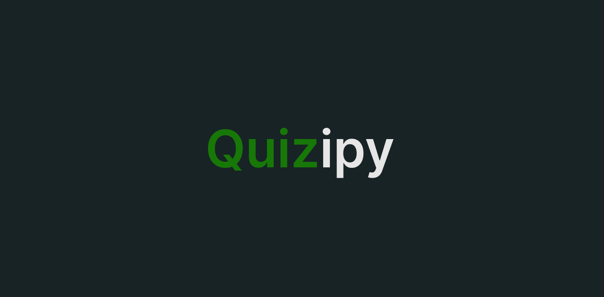

<h1 align="center">
    <br>
    <a href="https://quizipy.vercel.app" target="_blank">
        
    </a>
    <br>
    Quizipy
    <br>
</h1>

<h4 align="center">
    An online platform that lets users search, play, and create quizzes for an interactive learning experience
</h4>

<p align="center">
    <a href="#-demo">Demo</a> •
    <a href="#-features">Features</a> •
    <a href="#-technologies">Technologies</a> •
    <a href="#-installation">Installation</a> •
    <a href="#-usage">Usage</a> •
    <a href="#-license">License</a>
</p>

## 👀 Demo

You can check out a live demo 👉[here](https://quizipy.vercel.app)👈.

## 🔥 Features

-   Categories
-   CRUD operations with quizzes and questions
-   react-hook-form and API routes validations using Zod
-   Image uploading using ImageKit.io
-   Authentication using NextAuth.js
-   Search functionality
-   Dynamic metadata

## 🔧 Technologies

-   Next.js
-   Prisma
-   TypeScript
-   Tailwind CSS
-   Radix UI

## 🔌 Installation

-   Clone this repo

```bash
git clone https://github.com/K0D0D/portfolio.git
```

-   Go to the project directory

```bash
cd portfolio
```

-   Install dependencies

```bash
npm i && cd /studio && sanity install
```

-   add the Sanity CMS Project ID and Dataset to the .env.local file

```bash
NEXT_PUBLIC_SANITY_PROJECT_ID=YOUR_SANITY_PROJECT_ID
NEXT_PUBLIC_SANITY_DATASET=YOUR_SANITY_DATASET
```

## 💻 Usage

Project directory

-   start the server

```bash
npm start
```

-   build the project

```bash
npm run build
```

Studio directory

-   run the studio server

```bash
sanity start
```

-   build the studio

```bash

```
